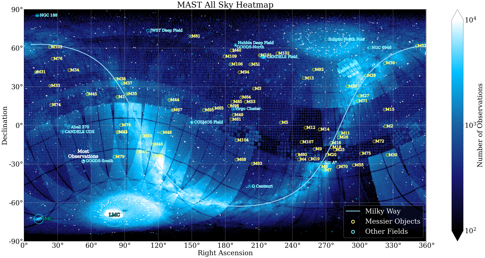
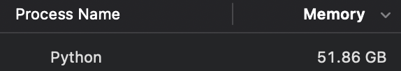
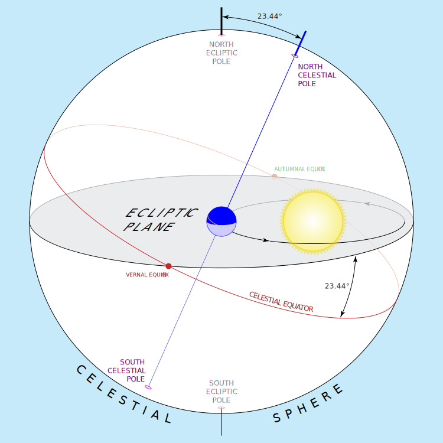

As of July 2025, MAST contains nearly *300 million* astronomical observations! That's a lot of data - but what does it look like? We have the answer!

These new wallpaper images depict MAST's View of the Sky! This is a image using astronomical coordinates RA and Dec, where each pixel is colored according to the number of observations in MAST at those coordinates. Dark pixels have fewer observations, while brighter pixels have many.

Scroll down for the full story.

## Downloadable MAST Wallpapers
Here are the MAST Wallpaper images for you to download and use wherever you'd like!

### Different Coordinate Projections
<table>
    <tr style="display:block">
        <td style="text-align:center;">
        
          Celestial Coordinates  (RA, Dec)
        </td>
        <td style="text-align:center;">
        
         Ecliptic Coordinates (longitude, latitude)
        <td style="text-align:center;">
        
          Galactic Coordinates  (l, b)
        </td>
    </tr>
</table>

### Different Colors
<table>
    <tr>
        <td style="display:block">
            
            
            
            
            
            
            
            
            
            
            
            
            
            
            
            
            
            
        </td>
    </tr>
</table>

## So, What am I looking at?

There's a lot going on in this image - here's an annotated version to help decipher what you are looking at!

This is a plot of celestial coordinates *Right Ascension* (on the x-axis) and *Declination* (on the y-axis), where each pixel is colored by the number of observations in MAST at that coordinate, randing from 0 (black) to 10,000 (white).

You might notice some features in this image which highlight different telescopes. For example, the bright rectangles (most obvious in the bottom half of this plot) are [TESS Sectors](https://tess.mit.edu/observations/). Similarly, the "+" shaped stamps along the ecliptic plane are the characteristic footprint of [the Kepler and K2 Missions](https://archive.stsci.edu/missions-and-data/k2).

Many of the most-observed areas of the sky correspond to interesting astromical objects, Such as the U-shaped curve of the Milky Way, our neighbor galaxies the LMC and SMC, or the various star clusters and nebulae in the Messier catalog.

The winner for the most observed area in the sky is the [GOODS-South Field](https://webbtelescope.org/contents/media/images/2021/004/01EX2AXKF1EKA0J7K1965PCNBC), a galaxy-rich field containing over 7,500 galaxies used to study the formation history of the Universe.

### Different Missions

MAST contains data from over 23 different missions, all of which have their own unique footprint on the sky. This figure shows the footprint for 16 different data collections, showing the sky map and number of observations in each. 

You'll see that the coverage of the sky depends highly on which mission you select! HST and JWST have observed lots of scattered points across the whole sky. Compare that to something like Pan-STARRS, which uniformly covered the entire sky north of declination -30 degrees.

The largest collection, by far, is our [High-Level Science Products](https://mast.stsci.edu/hlsp/#/). This is due, in part, due to intense community interest in reprocessing TESS observations.

### Evolution of MAST

This animated GIF shows how the archive has built up over time:

Starting with the launch of HST in 1990, only small points of the sky were observed and start to build up over time. Around 2010, data from the Sloan Digital Sky Survey (SDSS) comes into play and starts to cover larger areas of the sky. When TESS launched in 2019, the data really explodes. The upcoming launch of the Roman Space Telescope will add over 20,000 terabytes more data to MAST!

## How did you make this?

First, consider a "typical" use of the archive: astronomers want to download data from a telescope. This is a two stage process: you might start by querying for HST observations of M101 in the ultraviolet range, then download all calibrated files produced by those observations. The first step is a metadata search, where you filter on telescope, wavelength, and [other fields we make searchable in the MAST metadata database](https://mast.stsci.edu/api/v0/_c_a_o_mfields.html).

MAST is not *merely* a data archive; we spend lots of time and effort making sure that our metadata are accurate, too. Given that we have over 300 million observations in our archive, this is no small feat. Using the central coordinates of all observations in our database, we can create this density plot on the sky!

## Yeah, but like, HOW specifically did you make this?

Put simply, these plots were made by querying the MAST metadata database to retrieve the central coordinates of every observation using an [ADQL](https://en.wikipedia.org/wiki/Astronomical_Data_Query_Language) query. "Dear MAST, please send me the RA and Dec of every observation you have!"

Because there are so many observations in MAST, this cannot be done in a single query unless your computer has a very large amount of RAM, so we do not recommend trying to do this at home.

<small>*WARNING: Do not try this at home!*</small>

At the end of this process, you'll have the first image from the intro of this post:

<small>A deliciously crispy 15000x7500 image of MAST's view of the sky. Ah, the smell of roasting RAM in the office.</small>

### I want to make my own map!

*You probably should not do this!* The exact query used is intentionally not included in this post because it will impact the performance of our server if a bunch of people attempt it. If you're serious about wanting to make your own MAST visualizations, contact the MAST help desk at archive@stsci.edu and we can help direct you to the right data. A Jupyter Notebook tutorial showing how to make some of the plots in this blog post will be added to the [MAST Notebooks Library](https://spacetelescope.github.io/mast_notebooks/intro.html) sometime soon!

### Coordinate Reprojection
Now this is neat, but we have another trick up our sleeves: [astropy.coordinates](https://docs.astropy.org/en/stable/coordinates/index.html). Thankfully, our friends at astropy love to optimize code, and it was pretty painless to reproject all of MAST into another frame. Of the [available coordinate systems](https://docs.astropy.org/en/stable/coordinates/index.html#module-astropy.coordinates.builtin_frames), we went with `geocentricmeanecliptic` and `galactic`. 

#### Projection 1: Ecliptic
As a quick refresher, MAST uses coordinates aligned to the celestial pole, which is aligned to our rotating Earth. A declination of +90 is directly overhead the north pole, while -90 is directly overhead the south pole. Our first transformation is to the ecliptic plane, aligned instead to Earth's orbit around the sun:

<small>By <a href="//commons.wikimedia.org/wiki/User:CielProfond" title="User:CielProfond">CielProfond</a> - Own work, <a href="https://creativecommons.org/licenses/by-sa/4.0" title="Creative Commons Attribution-Share Alike 4.0">CC BY-SA 4.0</a>, <a href="https://commons.wikimedia.org/w/index.php?curid=156276169">Source</a></small>

Ecliptic coordinates are useful for space-based telescopes, since the sun is — by definition —always at a declination of 0º. In fact, the [survey design of the TESS spacecraft](https://youtu.be/Q4KjvPIbgMI&t=115) takes advantage of this by always keeping one camera on the ecliptic pole, with the others facing opposite the sun.

<small>Ohhhh, so that's why those observations make a straight line around the plane of the ecliptic! They're from TESS.</small>
#### Projection 2: Galactic
Galactic coordinates are, somewhat counter-intuitively, still centered on our Sun. In this case, 0º longitude is defined to be the line between the sun and the center of the galaxy. Latitude measures the angle of an object relative to the flat disk of the galaxy, as seen from Earth.

<small>By NASA/JPL-Caltech/ESO/R. Hurt - <a rel="nofollow" class="external free" href="http://www.eso.org/public/images/eso1339e/">http://www.eso.org/public/images/eso1339e/</a>, Public Domain, <a href="https://commons.wikimedia.org/w/index.php?curid=28274906">Source</a></small>

The nice thing about using the galactic coordinate system is that most stars are near the plane of the galaxy, so it shows up quite nicely on our plot!

<small>The Milky Way, as seen by MAST. Come on, TESS! Observe that last little part in the middle so we can see the whole galaxy.</small>

## Conclusions and Other Thoughts
It's pretty dang cool that through metadata alone, we can reconstruct the shape and even texture of the milky way. These images, which are gorgeous, are also a powerful reminder that MAST has a lot of data. And this is a reminder that those data are free for anyone to access, so check them out through our [search forms](https://mast.stsci.edu/search/ui) or our [astroquery API](https://spacetelescope.github.io/mast_notebooks/intro.html)!

### Stay tuned for more!

If you've read this far, thanks! Want more visualizations? Stay tuned to the blog! We'll post anything new here.